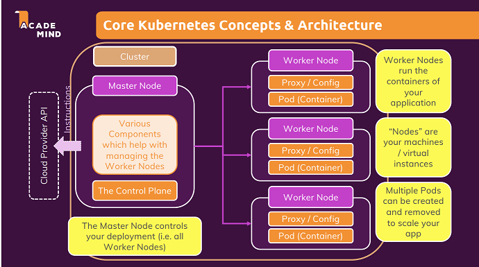
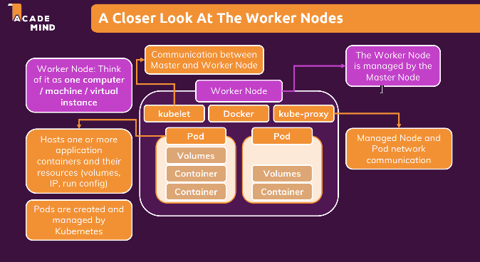

# Docker core Concepts

## Basics

**Containers**: Isolated "boxes" that contain our code and the environment needed to run it. 1 container must be focused in only 1 task.
**Images**: Created by docker files. They contain the code and the envidonment. They are the blueprint of the container and are readonly

## Basic commands

1. Build an Image
   `docker build -t <NAME:TAG> <path of dockerfile> `
2. Run a container based on a remote or local storage
   `docker run --name <name> --rm -d <IMAGE>` --rm => remove after stopping; -d detached mode
3. Push and pull to docker hub
   `docker push <REPOSITORY/NAME:TAG>` `docker pull <REPOSITORY/NAME:TAG>`

## Bind Mounts & Volumes

**Bind Mounts**: Used to connect to host machine folders
`-v /local/path:/container/path`

**Volume**: Used to persist the data
`-v NAME:/container/path`

## Networks and Container communication

**Create a docker network**: Using a network, containers can communicate with each other.

## Docker-compose

Allows to pre-define the build and run steps in a .yaml file. It is specially helpful in multiple containers project.

To call this file I use in the .yaml path the command `docker-compose up`. To stop the services I use `docker-compose down`

## Deploy considerations

- Replace **Bind Mounts** with Volumes or COPY
- Multiple containers might need multiple hosts
- Multi-stage Builds help with apps that need a build step

* **Control** : EC2 remote server, install Docker and run containers.
* **Ease-of-use**: ECS managed server, write the commands in AWS

# Kubernetes

Is a open-source system for orchestrating container deployments. It helps with **Automatic Deployment**, **Scaling & load balancing** and **Management**

**Core Concepts**:

- Cluster: Set of Node machines which are running Containerized.
- Nodes: Physical or virtual machine which hosts one or multiple Pods and communicates with the Cluster
  - Master Node: Control Plane of the cluster. It manages the pods across Worker nodes
  - Worker Node: Machines Hosting Pods and running app containers
- Pods: Application Containers + needed Resources (for example Volumes)
- Containers: Regular Docker Containers
- Services: A Logical set of Pods with a unique Pod - / Continer- independent IP adress

## Installation

1. Install [chocolatey](https://chocolatey.org/)
2. in Docker Desktop enable kubernetes or run in CMD `choco install kubernetes-cli`
3. in CMD run `choco install minikube`
4. If I want to have a virtualbox (with docker I dont need) install [virtualbox](https://www.virtualbox.org/)
5. To run the minikube in CMD run `minikube start --driver=docker`
6. Run `minikube status` to check if the minikube is runing or `minikube delete` to delete the virtual machine
7. Run `minikube dashboard` to open a tab with the cubernetes information in the browser

<!-- ## In detail, this course includes the following topics:

    A thorough introduction to Docker, containers and why you might want to use Docker

    Detailed setup instructions for macOS and Windows

    A deep-dive into the core concepts you need to know: Containers & images

    Learn how to create custom images, use existing images and how to run containers based on such images

    Get a detailed overview of the core commands you need when working with Docker

    Learn how to work with data and how to persist data with volumes

    Explore container networking - with the outside world and between multiple containers

    Learn how to work with both single and multi-container projects

    In-depth deployment instructions: Manual deployment and deployment with managed services like AWS ECS

    Understand Kubernetes core concepts & architecture

    Learn how to create Kubernetes resources, deployments, services and how to run your containers with Kubernetes

    Dive deeply into working with data in Kubernetes projects - with different types of volumes

    Kubernetes networking and DNS service discovery

    Learn how to deploy your Kubernetes project (at the example of AWS EKS)

    And much more!

    All these topics are taught in great detail with slides and theory but also, most importantly, with many examples and demo!

    You'll find tons of demo projects throughout the course - using programming languages like NodeJS, Python or PHP (with Laravel). You don't need to know these languages to follow along though, no worries!

## What you’ll learn

    Learn what Docker and Kubernetes are and why you might want to use them
    Learn how to install and use Docker on any system (macOS, Windows, Linux)
    Learn how to create and use Images & Containers with Docker
    Understand complex topics like managing and persisting data with Volumes
    Learn about Container Networking with Docker Networks and DNS Service Discovery
    Learn how to deploy Docker applications - manually, with managed services or with Kubernetes -->
