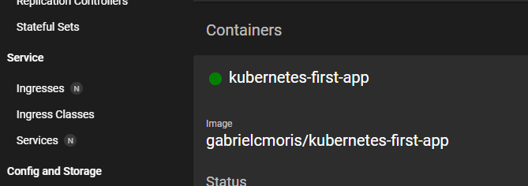

# Start Kubernetes in imperative Approach

**It works in Powershell**

## Deployment Object

1. Create the Dockerfile and build the image `docker build -t kub-first-app .`
2. Check if minikube is running `minikube status`. if not run `minikube start --driver=docker`
3. Create the repository in docker hub
4. Retag the img `docker tag kub-first-app gabrielcmoris/kubernetes-first-app`
5. Push the image `docker push gabrielcmoris/kubernetes-first-app`
6. Send the image to kubernetes `kubectl create deployment first-app --image=gabrielcmoris/kubernetes-first-app`
7. Use `kubectl get deployments` to see the deployments and `kubectl get pods` to check the pods
8. use `kubectl delete deployment first-app` to delete a deployment
9. run `minikube dashboard` to see the dashboard

## Service Object

1. To create a service we run `kubectl expose deployment first-app --type=LoadBalancer --port=8080`
2. To see the services exposing `kubectl get services`
3. To see a service from minikube `minikube service first-app`. Since I am working in a virtual machine that is how I can get the ip exposed.

### Others

To scale run `kubectl scale deployment/first-app --replicas=3` and the load balancer will distribute the trafic to the 3 pods

To update a deployment, after uploading in docker hub **with a new tag** `docker build -t kub-first-app:v2 .` `docker push gabrielcmoris/kubernetes-first-app:v2`, run `kubectl set image deployment/first-app kubernetes-first-app=gabrielcmoris/kubernetes-first-app:v2`. For this I will need the container name. I can find it in minikube dashboard.

To rollback a failed deployment run `kubectl rollout status deployment/first-app`
I can see the rollout history with `kubectl rollout history deployment/first-app`
And I can go to a specific rollout with `kubectl rollout undo deployment/first-app --to-revision=1`

To delete the service and deployment run `kubectl delete service first-app` and then `kubectl delete deployment first-app`

# Start Kubernetes in declarative Approach

It is possible to start kubernetes in the same way as docker compose.

- For Deployment I create a file `deployment.yaml` and run the command `kubectl apply -f deployment.yaml`
- For Service I create a file `service.yaml` and run the command `kubectl apply -f service.yaml`
- To see the app in browser I run `minikube service backend`
- To delete the deployment I run `kubectl delete -f deployment.yaml`
