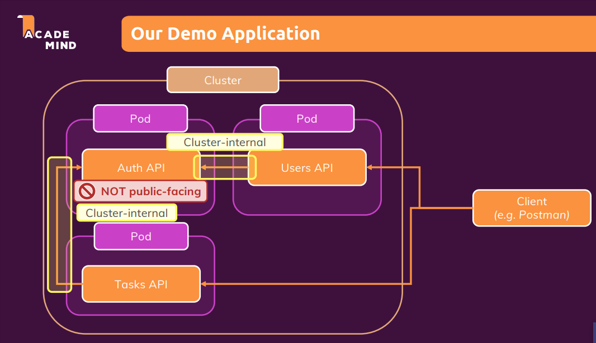

# Networking

## Schema Demo:



## Start project

- Enable virtual machine (minikube) `minikube start --driver=docker`
- For the beginning, hardcode in `users-app.js` all the calls to `/auth`, then When I enable the /auth I can revert the changes
- Upload to docker hub `docker build -t gabrielcmoris/kub-demo-users .`, `docker push gabrielcmoris/kub-demo-users`
- In the folder /kubernetes I will create all files and run with `kubectl apply -f users-deployment.yaml -f users-service.yaml`
- To check the deployment in minikube, run: `minikube service users-service`
- Change in `/users-app.js` the calls to `/auth again to put a env variable`
- Upload to docker hub again `docker build -t gabrielcmoris/kub-demo-auth .`, `docker push gabrielcmoris/kub-demo-auth`
- Now with both containers **users API** and **Auth api** in the same container, the communication will work through `localhost`

### Internal networking

- To manage network between different pods we need to use other way. Instead of `http://${process.env.AUTH_ADDRESS}/token/` we use `http://${process.env.AUTH_SERVICE_SERVICE_HOST}/token/` being AUTH_SERVICE the name of the service in capitals. This is an env variable generated automatically from Kubernetes.
- Afterwards we can reapply everything `kubectl apply -f users-deployment.yaml -f users-service.yaml -f auth-deployment.yaml -f auth-service.yaml`

### Internal DNS networking

- In the users-deployment I can use just ste name of the service as a env variable:

Instead

```yaml
containers:
  - name: users
    image: gabrielcmoris/kub-demo-users:latest
    env:
      - name: AUTH_ADDRESS
        value: localhost
```

Use

```yaml
containers:
  - name: users
    image: gabrielcmoris/kub-demo-users:latest
    env:
      - name: AUTH_ADDRESS
        value: "auth-service.default"
```

- And use inside the users-app the ENV `AUTH_ADDRESS` instead `AUTH_SERVICE_SERVICE_HOST`
- Afterwards we can reapply everything `kubectl apply -f users-deployment.yaml -f users-service.yaml -f auth-deployment.yaml -f auth-service.yaml`

### Adding Tasks

- Change the api call to auth to the variable `AUTH_ADDRESS`
- Upload to docker hub `docker build -t gabrielcmoris/kub-demo-tasks .`, `docker push gabrielcmoris/kub-demo-tasks`
- Afterwards we can reapply everything `kubectl apply -f users-deployment.yaml -f users-service.yaml -f auth-deployment.yaml -f auth-service.yaml -f tasks-deployment.yaml -f tasks-service.yaml`
- We also need to create the container `minikube service tasks-service`

-to stop run `kubectl delete -f users-deployment.yaml -f users-service.yaml -f auth-deployment.yaml -f auth-service.yaml -f tasks-deployment.yaml -f tasks-service.yaml`

## Add Frontend

- Inside App.js I change the ips for the ips currently running in the minikube
- Start the minikube services `minikube service tasks-service` & `minikube service users-service` and copy the url of Tasks in App.js
- Build and upload project `docker build -t gabrielcmoris/kub-demo-frontend .` and run it `docker run -p 80:80 --rm  gabrielcmoris/kub-demo-frontend`
